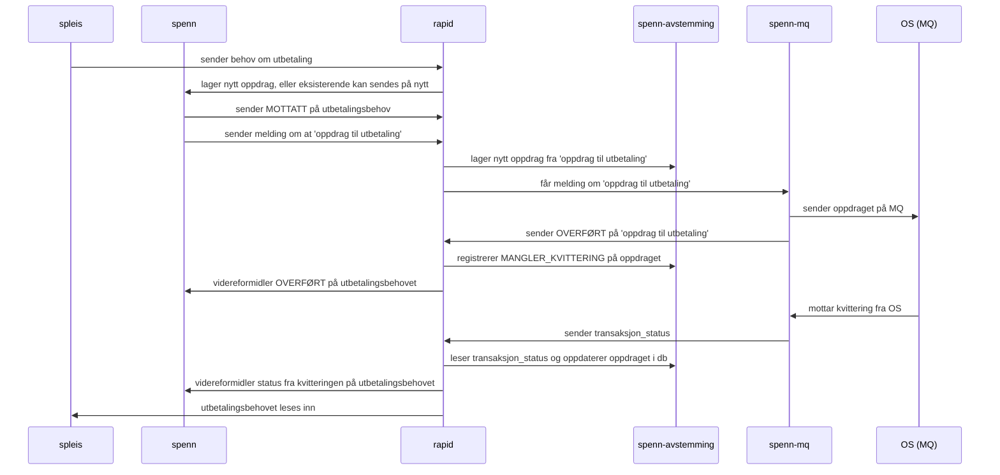

# Spenn


## Beskrivelse

Lese utbetalingsbehov og simuleringsbehov og håndterer kommunikasjon videre mot Oppdrag/UR.



### Avstemming

Avstemming kjører som en CronJob (via NaisJob) i Kubernetes:

```
% k get cronjobs -n tbd                
NAME               SCHEDULE    SUSPEND   ACTIVE   LAST SCHEDULE   AGE
spenn-avstemming   0 7 * * *   False     0        <none>          22m
```

### Simulering

Kjører som `spenn-simulering` i FSS

### Utbetaling

Kjører som `spenn` i GCP.

## Hvorfor Spenn?

Spenn heter spenn fordi det er en tjeneste som 100% bryr seg om penger. Spenn.

## Henvendelser

Spørsmål knyttet til koden eller prosjektet kan stilles som issues her på GitHub.

### For NAV-ansatte

Interne henvendelser kan sendes via Slack i kanalen #område-helse.
