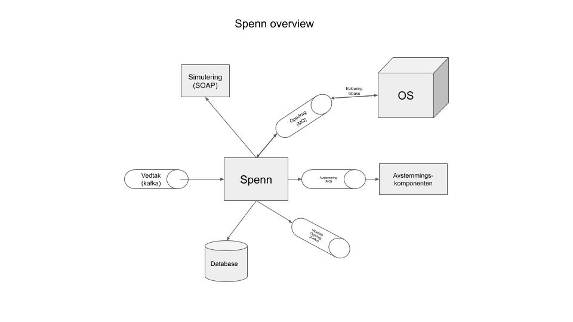

[](https://circleci.com/gh/navikt/helse-spenn/tree/master)
[](https://snyk.io/test/github/navikt/helse-spenn)

# Spenn 

## Oppgaver
1. Hente inn vedtak fra kafka topic
2. Lage og mappe et utbetalingsoppdrag fra vedtaket
3. Kjøre simulering for utbetalingsoppdraget
4. Sende oppdraget videre til Oppdragsystemet (OS), og vente på kvittering
5. Starte avstemmingsfunksjonen for å verifisere at alle oppdragene stemmer med OS.
6. Generere en utbetalt melding og legge den i kafka-kø
7. Lagre oppdragtilstandene i database
8. Tilby REST-endepunkter for uthenting av oppdragene og for å kunne kjøre simulering 
9. Kan sende oppdraget på nytt hvis ønskelig



## Kjøre på dev eller localhost

```
mvn clean install
docker-compose up --build 
```

Ved endringer av database-schema kan jooq-ting regenereres sånn:

```
mvn -Pjooq clean install
```

... og deretter må man gjøre endringer i `OppdragStateJooqRepository`
